

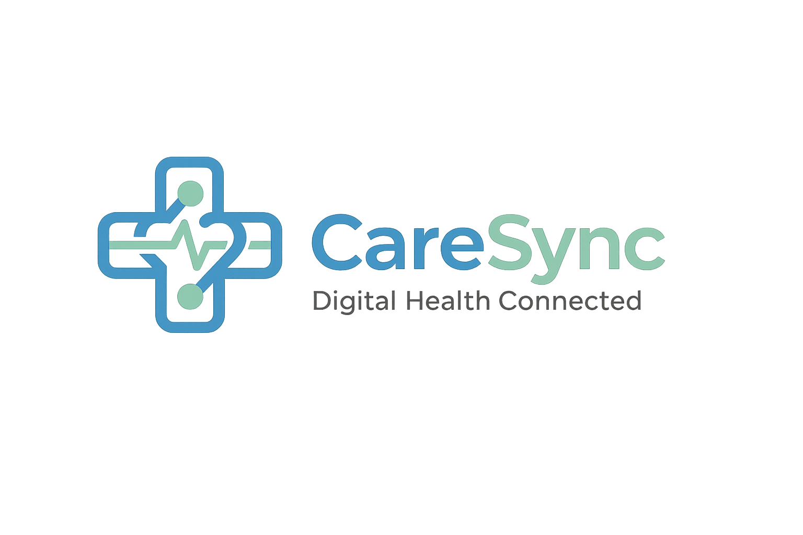

# CareSync — Intelligent Healthcare, Simplified

**A premium, multi-role intelligent healthcare ecosystem bridging the gap between patients, doctors, and pharmacies through AI diagnostics, voice-activated booking, and HD teleconsultations.**

---

---

## 🌟 Overview

CareSync is a state-of-the-art, full-stack digital health platform designed to unify the healthcare journey. By connecting Patients, Doctors, and Pharmacies into a single, cohesive experience, CareSync removes administrative friction and empowers users with real-time analytics, automated risk prediction, and seamless communication channels.

### 📐 System Architecture

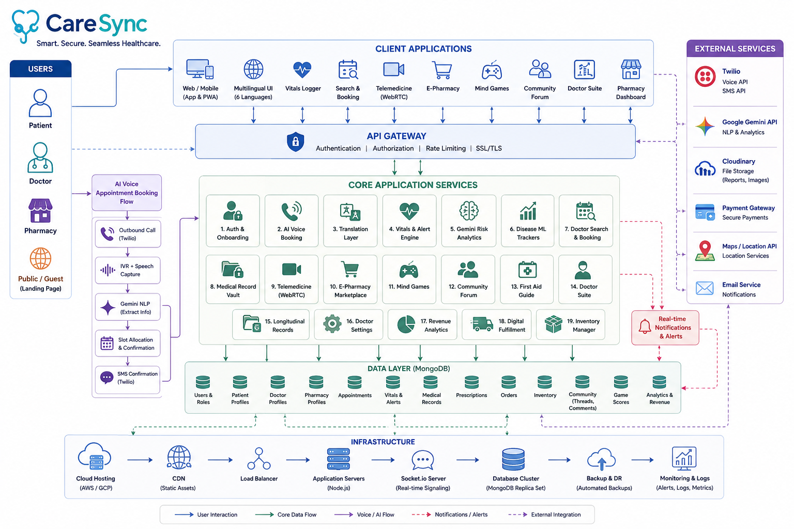

---

## 🎭 Role-Based Access

CareSync provides custom-tailored environments for three key healthcare roles:

| 👤 Patient Suite | 🩺 Doctor Portal | 💊 Pharmacy Dashboard |
| :--- | :--- | :--- |
| • AI-assisted and voice-based bookings • Real-time vital tracking & risk prediction • Secure medical records vault • Direct telehealth & online medicine shopping | • Calendar & consultation manager • Longitudinal patient records & vital history • Real-time digital prescriptions • Availability & pricing configurations | • Sales & operations analytics panel • Digital order dispatch & prescription verification • Dynamic medicine inventory manager |

---

## 🏥 Patient Experience

### 🔐 Secure Multi-Role Authentication
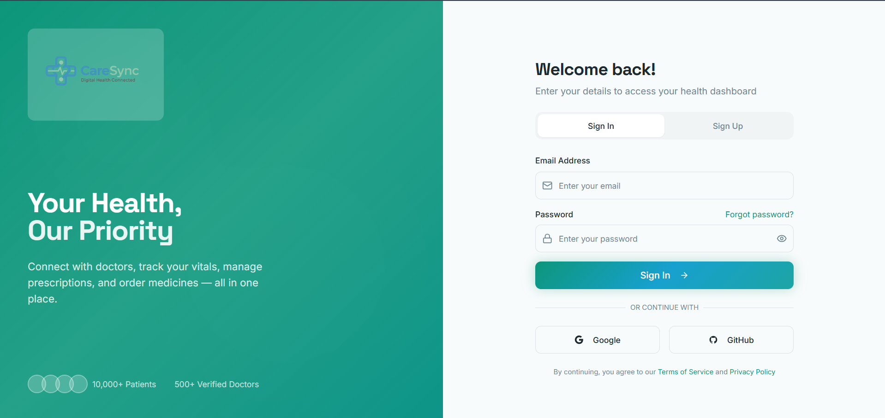
CareSync features an advanced JWT-secured authentication system tailored for Patients, Doctors, and Pharmacies. During onboarding, patients set up their custom health profile—including pre-existing chronic conditions—to calibrate their personalized AI dashboard.

---

### 📞 Interactive Landing Page & AI Voice Booking
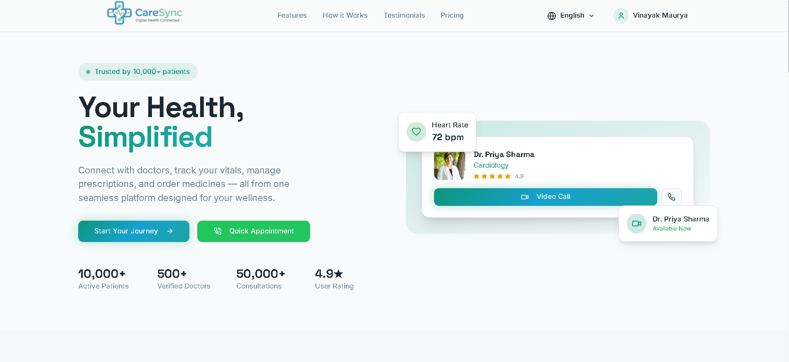
An engaging, multilingual landing page supporting 6 regional languages (English, Hindi, Marathi, Tamil, Telugu, and Bengali) with real-time translation. It features our flagship AI Voice Agent powered by Twilio and Google Gemini, allowing patients to schedule medical appointments via a simple telephone call without even logging in.

---

### 📊 Health & Risk Analytics Dashboard
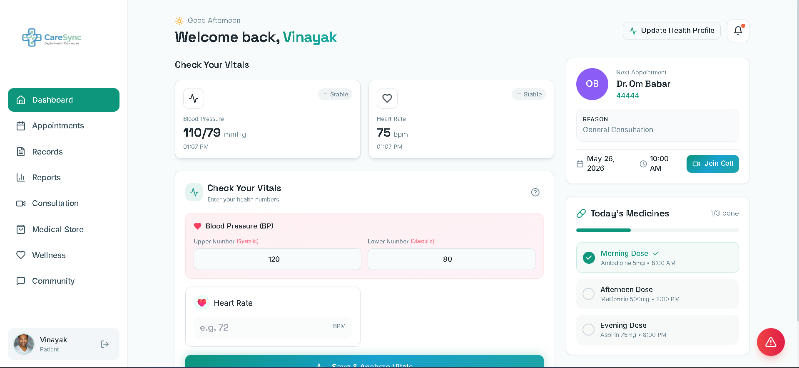
The patient’s central command hub, displaying live vital trends (blood pressure, heart rate, blood sugar, SpO₂) with active status checks. The dashboard uses custom-trained machine learning models and Google Gemini AI to analyze trends, predict upcoming risk levels, flag critical anomalies, and recommend customized medical actions.

---

### 📅 Multilingual Doctor Booking
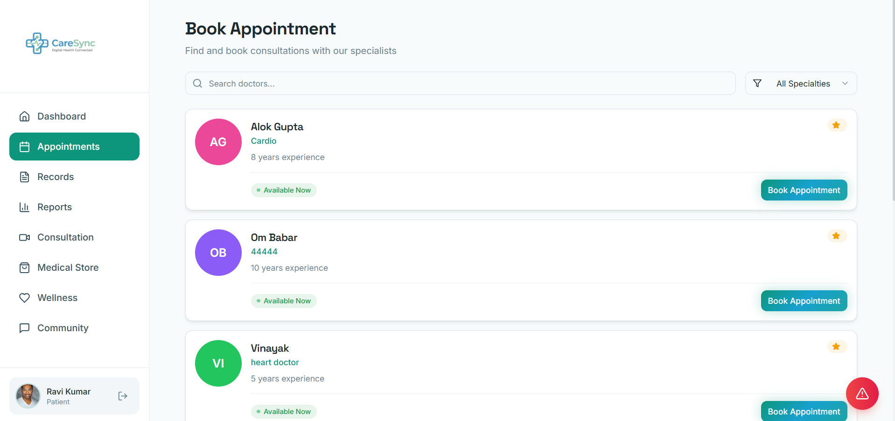
A streamlined booking engine enabling patients to search for specialist physicians, filter by rating, experience, or consultation fees, and reserve digital or physical slots. The system performs instantaneous backend validation to eliminate scheduling conflicts.

---

### 📁 Secure Medical Record Vault
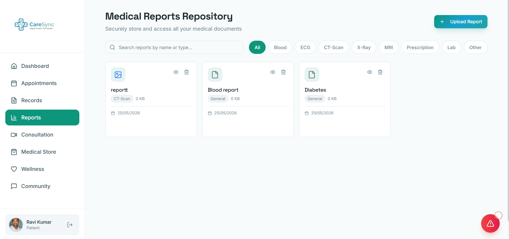
A secure repository for storing and organizing laboratory tests, diagnostic images, and PDFs. Patients can quickly upload records, which are instantly mapped and shared with their consulting practitioners during appointments.

---

### 📹 Telehealth and Video Consultations
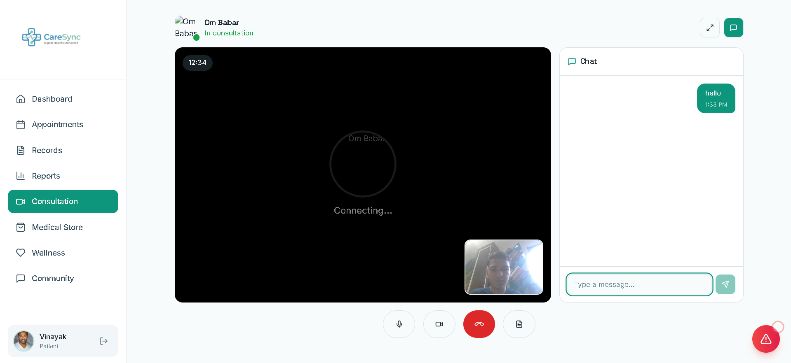
A real-time, browser-native virtual clinic powered by WebRTC and Socket.IO for HD video consultations. Patients can interact face-to-face with their physicians and access live digital prescriptions directly within the call interface.

---

### 🛒 E-Pharmacy Marketplace
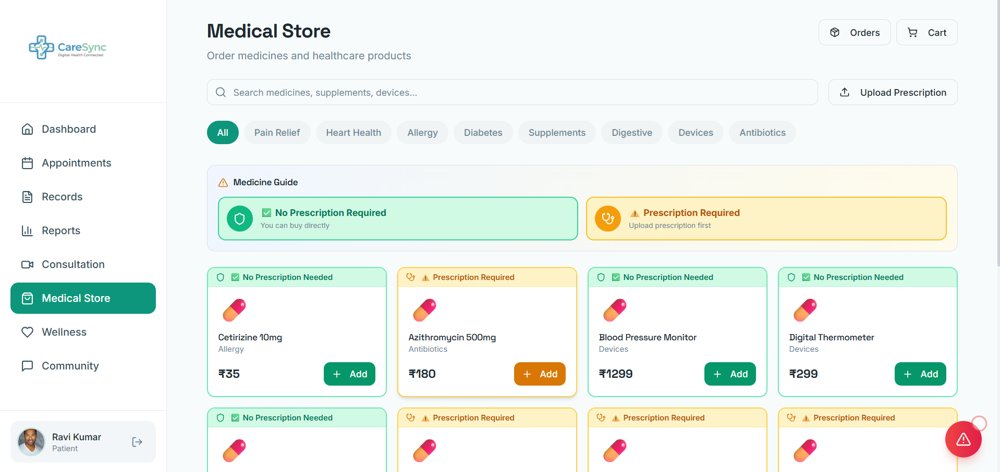
A complete electronic store for ordering prescription and over-the-counter medications. Patients can search catalog items, manage their cart, securely check out, and track their delivery status in real time.

---

### 🧠 Wellness & Brain Training

  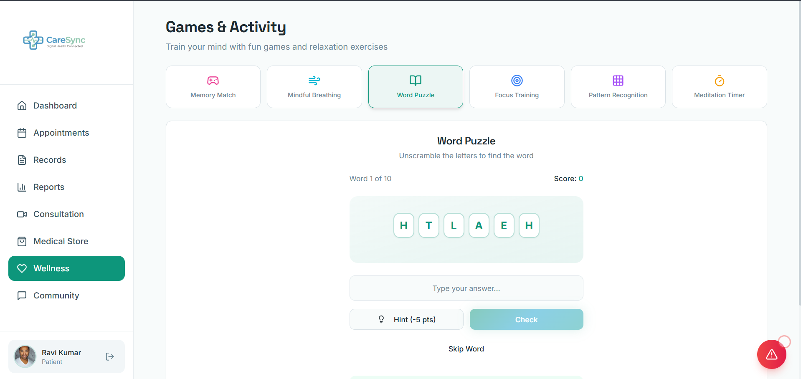
  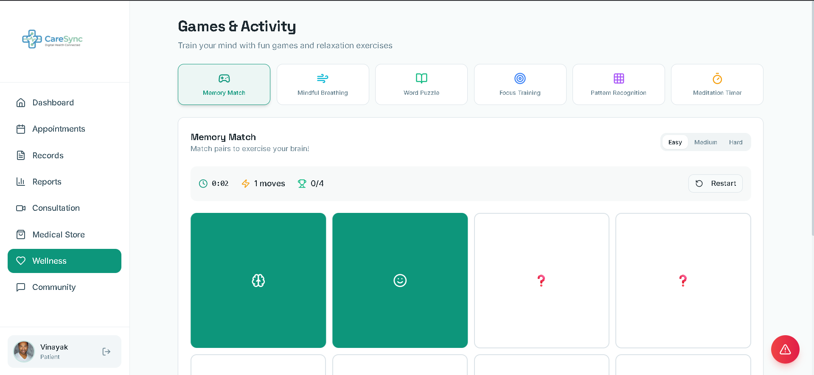

 
Engaging, custom-designed cognitive games aimed at promoting mental wellness and tracking brain agility. Patients can challenge themselves, view high scores, and monitor long-term cognitive health parameters from their profile.

---

### 💬 Support Networks & Community
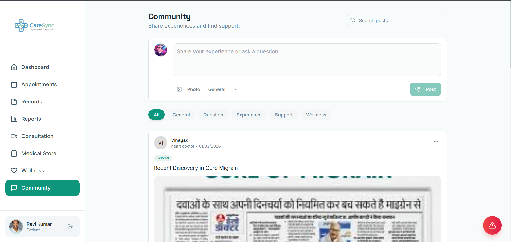
An interactive community board enabling patients to exchange experiences, read educational articles, and discuss treatment paths in a moderated, supportive space.

---

### 🚨 Emergency First-Aid Assistance
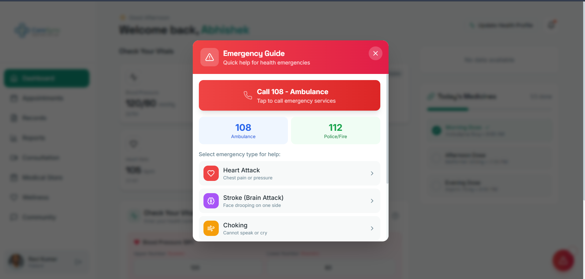
An offline-ready, quick-access emergency module presenting step-by-step first-aid protocols for urgent medical scenarios, providing crucial guidance when every second counts.

---

## 🩺 Doctor Suite

### 📅 Professional Appointment Manager
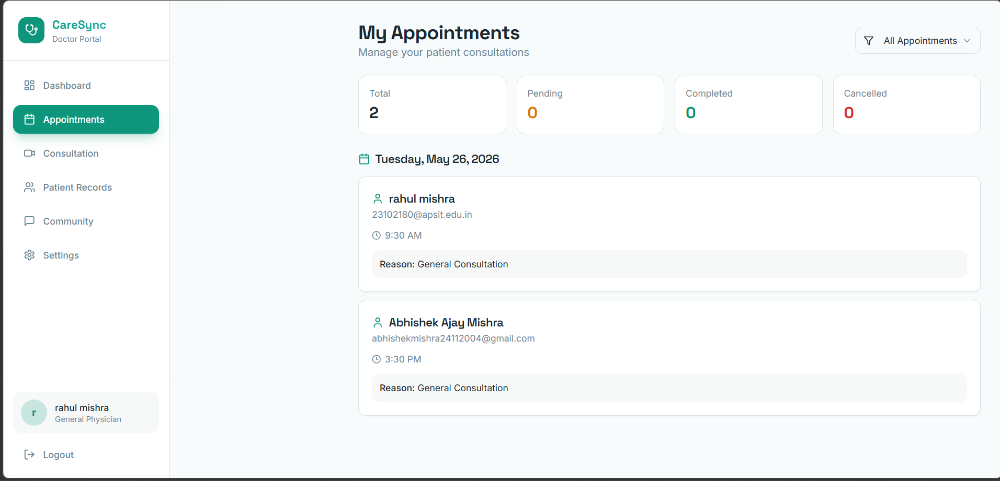
A robust practitioner scheduler providing real-time management of upcoming patient bookings. Doctors can quickly review clinical details, accept or reschedule consults, and launch telehealth sessions.

---

### 🗂️ Longitudinal Patient Records
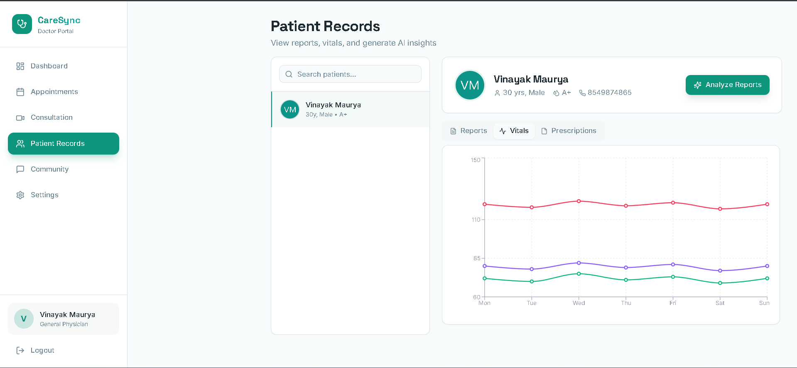
A secure medical workstation giving physicians a comprehensive view of patient histories. Doctors can review longitudinal vital logs, analyze uploaded PDF reports, and issue authenticated digital prescriptions.

---

### ⚙️ Settings & Smart Scheduling
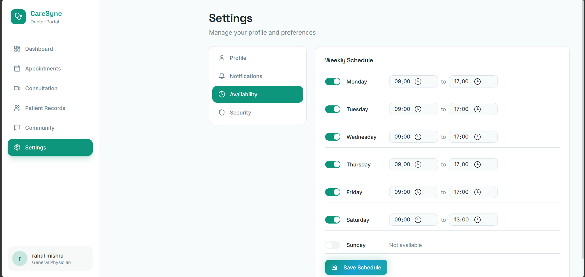
A centralized configuration interface enabling medical professionals to customize their clinical availability, update consulting fees, edit bio profiles, and configure automated notification preferences.

---

## 💊 Pharmacy Operations

### 📈 Pharmacy Operations Control Panel
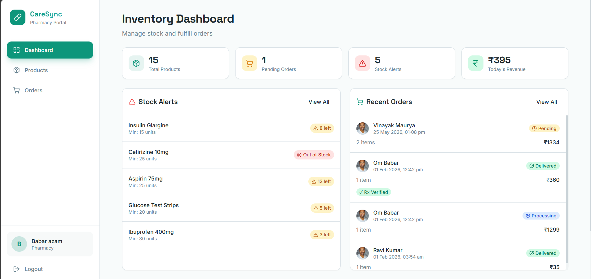
A high-level operations dashboard built for pharmacy managers to monitor sales analytics, track pending prescription orders, identify popular medications, and view overall business revenue.

---

### 📦 Digital Order Dispatch
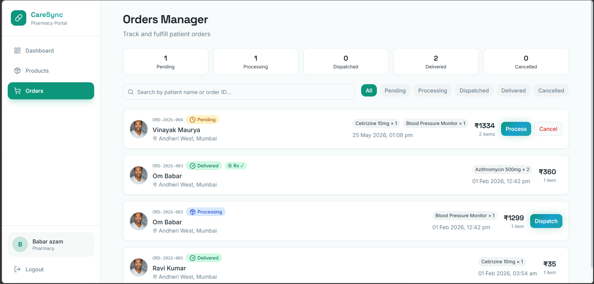
An intuitive shipping and fulfillment queue that displays incoming medication orders, verified prescriptions, customer addresses, and real-time delivery status updates.

---

### 🏷️ Catalog and Inventory Control
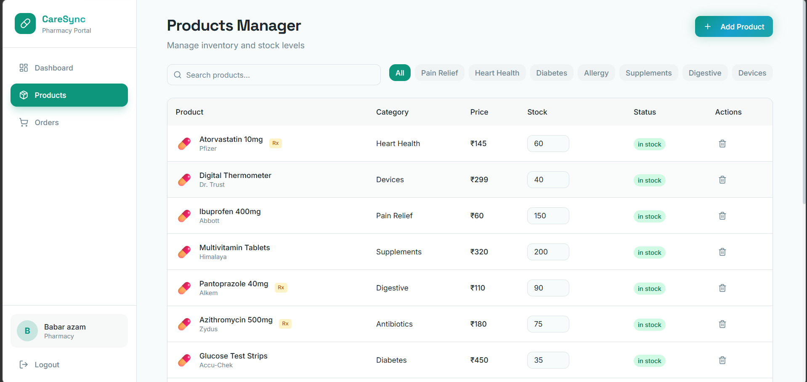
An agile stock manager allowing pharmacies to add new medicine listings, adjust prices, edit availability details, and view automatic warnings when inventory levels run low.

---

## 🎬 Platform Demonstration

Experience CareSync in action! Watch our comprehensive walkthrough showing the AI Voice Booking, vital tracking with Gemini warnings, patient-doctor video consultation, and pharmacy dispatch loops.

  <h3><a href="https://bit.ly/4nMi689" target="_blank">📺 Watch the Demo Video</a></h3>
   
  <a href="https://bit.ly/4nMi689" target="_blank">
    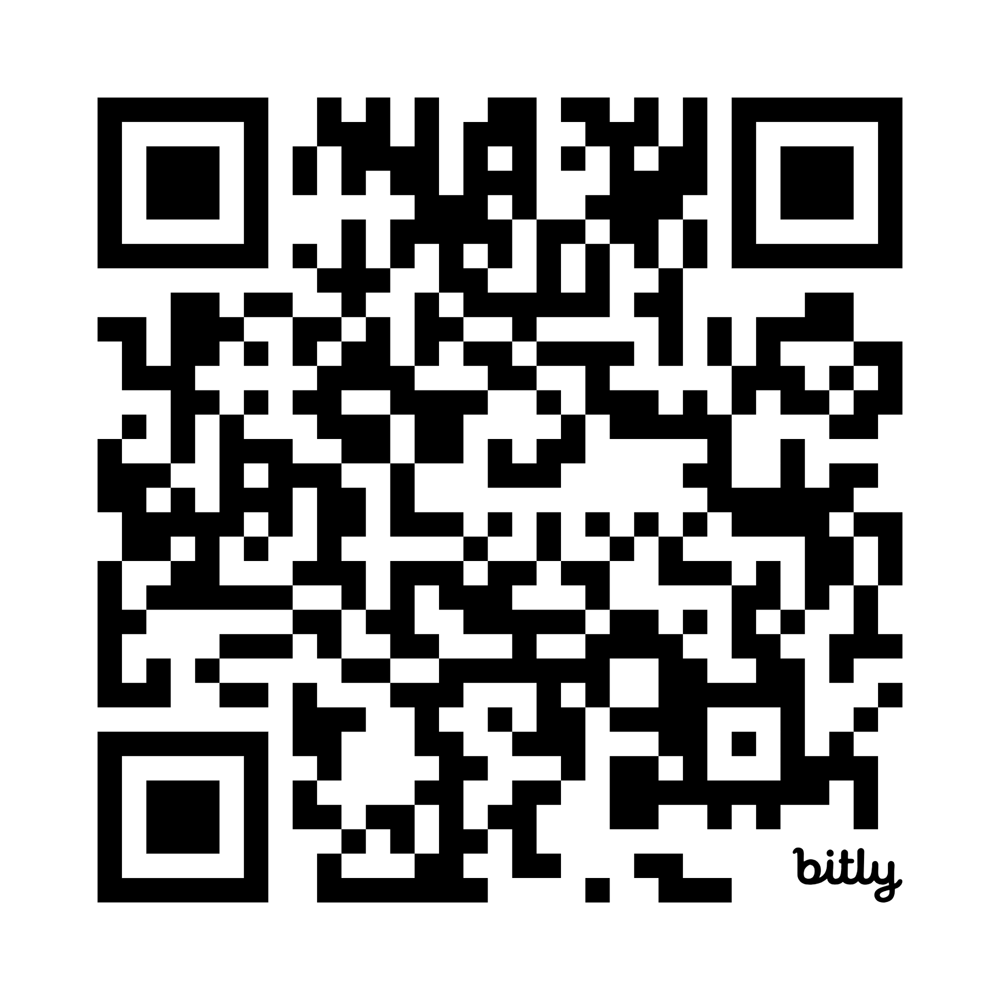
  </a>
  
<i>Scan the QR Code to watch the demo directly on your mobile device.</i>

---

## 🛠️ Tech Stack & Architecture

### 💻 Frontend

* **Architecture**: Vite-powered Single Page Application (SPA) with React 18
* **Real-time Comms**: WebRTC peer connections and Socket.IO real-time channels
* **Design Language**: Tailwind CSS utility classes and Radix UI components

---

### ⚙️ Backend & Storage

* **Runtime & Framework**: Express.js server on Node.js runtime
* **Database Layer**: MongoDB document database with Mongoose ODM modeling
* **Document Hosting**: Secure Cloudinary hosting for clinical report files
* **Communication APIs**: Twilio Voice (IVR call flows) and dynamic SMS gateways

---

### 🧠 Intelligence & Analytics

* **Generative Models**: Google Gemini API powering intelligent wellness reporting and conversational dialogue
* **Machine Learning**: Custom Python-based analytics for vital risk prediction and health trend mapping

---

  Developed with ❤️ for CareSync. All screenshots are authentic and captured directly from the live platform.

